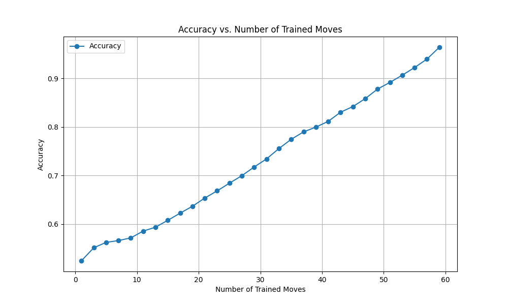
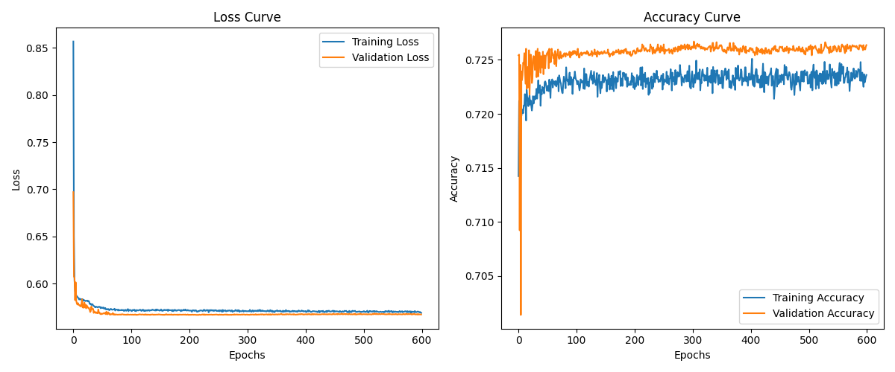

# Chess Match Prediction Based on Initial Moves

## Team Member Roles

Youcef Boumar \- Preprocessing, feature engineering, model creation, tuning, evaluation
Anthony Hunt \- Preprocessing, feature engineering, model creation, training, tuning, evaluation
Muzamil Janjua \- Model creation, input and output visualization, tuning, evaluation

## Context

Computation in the game of chess has historically served as a mainstream benchmark and demonstration of evolving computational power. From Deep Blue to Stockfish, deterministic optimization techniques for turn-based game engines have been continuously refined and improved for both efficiency and performance. In 2017, Google DeepMind introduced AlphaZero, a neural network-based approach to the game that bested the even highest rated engines of its time, advancing chess bots far beyond the abilities of the best human players[^1]. As such, playing against bots of all levels has become deeply intertwined with the act of learning the game.

Modern chess websites like chess.com and lichess.org have provided several tools in evaluating positions and predicting moves to aid players in the process of climbing the rating later. However, these predictions assume that players will always play optimally for the entire game, judging the score of a move by objective strategic or material gains, far beyond the proficiency level of average players. Therefore, when attempting to predict the probability of a player winning, deterministic algorithms fail to account for the hidden relationships, human biases, and differences in player abilities.

On the other hand, a data-oriented machine learning algorithm focused on player behavior rather than in-the-moment position analysis could help players determine the effects of specific moves on the outcome of their specific games. In turn, we may be able to use this knowledge to incorporate player mindsets and abilities in evaluating match performance, providing intuitive, personalized, and helpful feedback. We specifically aim to address questions that will help players fill in gaps left by deterministic analysis of games, such as, “Will a large material loss in the first 10 moves result in an immediate loss, even when facing a lower rated opponent?”, “How many moves must each side make before we can determine a winner with reasonable accuracy?”, or even “Is it possible to predict the winner of a chess match with consideration to player ability and historic performance?”.

## Dataset

The Lichess database contains over 1.92 TB of data, equivalent to \~6 billion recorded chess games, starting from 2013[^2]. In October 2024 alone, over 94 million games were recorded through rated matches played on lichess.org, with a compressed size of 30 GB. Games are stored in a standardized Portable Game Notation (PGN) format[^3], containing information about the date, player names, final result, player ratings, time limits, and an ordered list of moves in algebraic chess notation[^4]. 17 features can be built from game metadata, while moves contain information about the board state. Additionally, approximately 6% of all games include deterministic engine evaluations and timestamps for each move. As mentioned in the preprocessing section below, we use a more reasonable sample size of 10,000-100,000 recent games for initial testing. Given the complexity and nuance of written game notation, we will need to conduct extensive feature engineering tests to extract relevant information.

## Solution Proposal

For this project, we will attempt to build a predictive neural network model to determine the probability of a player winning based on their comparative performance of the first _X_ moves. We will compare the accuracy of different active sampling techniques in addition to limiting the amount of data required before making an accurate prediction. Given the time-based nature of some features and the overall flexibility of the dataset, recurrent neural networks may be a good choice to perform this analysis.

Although this idea independently originated from our personal experience learning from deterministic engines like Stockfish[^5], similar projects and papers have utilized decision trees, SVMs, naive bayes, random forest, and ensemble learning techniques. In particular, a similar open-source project[^6] trained a decision tree classifier on 20,000 games to predict the outcome of a match with 95% accuracy within the first 8 moves[^7]. Two theses explore the idea further, comparing various models and methods of interpreting the data[^8][^9]. It should be noted that none of these methods attempted to use neural network models.

Data processing will involve a primary conversion of PGN format to CSV for easier tensor translations. Moves will then need to be interpreted into a more usable score, likely using the per-move engine evaluations and timestamps built into some of the lichess database. After doing so, features will consist mostly of single numerical entries alongside high dimensional tensors to represent individual moves. The labels will consist of the match results (win, loss, or draw), as recorded by lichess. Python library “python-chess” will be useful in handling the PGN dataset, and pytorch will be essential for the creation of the neural network model. Sklearn may additionally prove useful in processing the large quantity of data, in particular categorical variables and scaled numerical data.

## Preprocessing (of Milestone 2’s Model)

Although small-scale projects in machine learning are often bottlenecked by the amount of available data, we found the opposite to be true for our chess game prediction model. With over 200 GB (90 million games) worth of information available in the last month alone, removing samples with missing information and undesirable traits was a necessary first step. Among the eliminated samples were games that had an abnormal match termination or an insufficient number of moves. Our model additionally required games that included the timestamp and deterministic engine evaluation for each move, reducing our total sample size to a more manageable 4 GB (2 million games). Because of memory and computational restrictions, we further shaved down the sample size to 10,000 games, with an 80-20 split validation set and test split. Thus, 20% of the total dataset was reserved for final testing and 16% (20% of the leftover 80%) for validation while training.

Samples for each game initially consisted of two parts: game metadata like player rankings, time limits, date, and match results, alongside a list of moves (and per-move metadata) made by each player. Irrelevant or duplicated information was then heuristically stripped from the dataset, like uninformative UTC timestamps and already-encoded openings[^10]. Most values, aside from the moves themselves, were then converted directly into one-hot-encoded features or normalized as necessary. In order to convert the Universal Chess Interface[^11] move notation into a usable format, we transformed each move into a 12-channel 8x8 “image” of the chess board’s state. Each channel represented the location of 6 types of pieces on the board for each player: pawn, knight, bishop, rook, king, queen. Due to the low number of initial features and the large amount of available data, dimensionality reduction techniques were not necessary. At the end of the preprocessing stage, each game had records of the following: match result (y-label, win/draw/loss), white ranking, black ranking, and a list of moves where each move contained the board state as a pseudo-image, per-move chess engine evaluation, and time per move.

## Implementation/Model Specifications (of Milestone 2’s Model)

Since our dataset contained image-like board states nested within sequential move data, we opted to use a supervised CNN-RNN network akin to those used for video classification[^12]. Each move’s image-like board state was comparable to a single frame of a variable length video, enabling convolutions to capture the locality of various pieces and their influence on the match.

The model specifically contained three convolutional layers piped into a two-layer RNN with three final fully-connected layers. After feeding convoluted data to an RNN, the classifier returned a class with 3 possible outcomes: a win for the white pieces, a draw, or a win for the black pieces. In our ADAM-based gradient descent function, we opted to use weighted cross-entropy loss to better balance predictions for the \~5% of games that ended in a draw. Regularization techniques to improve accuracy involved dropouts in the CNN and RNN, and a learning rate reduction after every loss function plateau. Loss and accuracy for an 80-20 validation split dataset were tracked and plotted every epoch to determine optimal hyperparameters. For this model, the selected hyper-parameters were as follows: 0.01 for initial learning rate, 200 epochs, 128 batch size, training on only the first 10 moves of each game, a 0.7 learning rate reduction with patience of 10 iterations, and a minimum learning rate of 10\-6.

## Preprocessing Improvements

In the evaluation section of Milestone 2, we made note of oddly high accuracies (65%+) when predicting the winner of games given only the first move. Intuitively, this result is incredibly suspect, as predicting the winner of a match based only on player rating and the first move seems highly improbable. Even at 10 moves, there should not be enough information to make a confident decision on the outcome of an average 40-move game.

A thorough investigation of our feature preprocessing revealed the cause of unnaturally high accuracy; the scaler used to standardize evaluation scores for each move inadvertently revealed the outcome of the game. Since all chess games begin at roughly equal evaluation and end with either a win, loss, or tie, the evaluation at the end of the move sequence will either be largely positive, negative, or near-zero in value (corresponding to a win/loss/tie). Fitting the scaler on all moves would then shift the initial evaluation in the opposite direction of the final evaluation, so a game where black maintains a constant evaluation advantage would see a high positive starting evaluation. After revising the scaling technique, the Milestone 2 model accuracy dropped to a more appropriate 30%, ie. it was unsure of the outcome of the game, given the first move. Milestone 3 now uses a min-max scaling technique based on the globally highest and lowest values available to the dataset.

In the Limitations section of Milestone 2, we noted that our model experienced prohibitively long training times, preventing the addition of more potentially valuable observations. Through further model experimentation, we found that both the nested CNN and its large image-like board state input consumed many computational resources without demonstrating a strong improvement to the overall accuracy of the scaling-adjusted RNN. Therefore, to address computational limitations and assist the model in uncovering relationships between past and present moves, we replaced implicit movement through board state data with explicit, one-hot encoded features for piece captures and position changes. Image data representing the board state was no longer needed, reducing complexity and individual sample size enough to allow reasonably fast training on 100,000-1,000,000 games.

From the original dataset of 2 million possible games, we selected inputs by excluding overly long games that lasted more than 60 moves, games that ended in a draw, games that ended abnormally (ex., abandoning the match), and those with uncommon time constraints (ex., some game modes add 5 seconds to player timers every turn). Note that removing rare-occurring draws from the dataset changed our classifier from ternary to binary and eliminated the need for weighted classes in our model. After preprocessing revisions, each game included the following: match result (y-label, either win/loss **\- no tie**), white ranking, black ranking, and a list of moves where each move contained the per-move chess engine evaluation, time per move, piece captured (if any), and moved piece.

## Model Specification Improvements

As mentioned in the Preprocessing Improvements section, the use of image-like data to encode the board state was not as useful as initially thought. The intended purpose of encoding the board state and passing it through a CNN was to give the model a sense of the moves made by each player. Secondarily, we hoped it would provide insight on the player positional advantage at each move. However, we found that the CNN portion of the model spent a lot of its time attempting to encode knowledge already available through positional engine evaluations, needlessly increasing training times and serving as a distraction from the true model objective. Although our previous statements about location and distance between pieces may still stand, proper encoding of the move itself and the resulting evaluation are far stronger predictors of player wins. Of course, if we did not choose to utilize deterministic engine evaluations, a separate CNN made solely to judge piece positions would be valuable for the model. But the purpose of this model is to predict the winner based on historic playstyles, rather than make predictions based only on the current board state. Therefore, our Milestone 3 model no longer contains a nested CNN and instead passes move data directly to the RNN.

For the purpose of making the RNN simpler, we found keras and tensorflow to be a more usable, efficient, and performant alternative to the previously-used pytorch. The model architecture remains the same as in Milestone 2 except for the removal of the nested CNN, resulting in two recurrent and 3 fully-connected layers. In addition to the existing reduced learning rate regularization technique, we added early stopping and higher dropout rates. A smaller learning rate of 0.001 with a batch size of 128 was found to be the most suitable for this new, simpler model to balance reasonable training times with good performance.

## Evaluation

Preliminary evaluation measures for this project began with a simple test for accuracy. Our original goal was to benchmark the accuracy of our model to that of a comparable decision tree model[^13], about 90% given an input of 10 moves. However, given our investigation with contaminated data in **both** the benchmark and our own Milestone 2 model, ensuring a reasonable accuracy based on the number of available moves serves to be a far more interesting topic. With our claim that game outcomes between players of equal skill cannot be reasonably determined in the first few moves, we expect accuracies in the 50-55% range, no better than a coin flip. Then, as we make more moves available in both training and testing, we should find a steady increase in the accuracy. The length of games in our dataset follows a gaussian distribution centered around the 30-40 move mark, so we expect our model to perform with a high degree of accuracy on 60-move data. Training on 60-move data intentionally “leaks” the results of the match through the position evaluation and is only used to test our hypothesis. Our model follows these predictions closely as shown in the plot to the right; more moves correlates to a near-linear increase in accuracy:

In contrast to Milestone 2, our revised model never seemed to fall into the one-class local minima, which had previously caused the model to predict only one class no matter the input. Accuracies for training and validation started at the expected 50% and steadily increased over time. Confusion matrix metrics (TP, FP, TN, FN) behaved as expected, with TPR and FPR calculations satisfying equalized odds measurements. The loss and accuracy plots for games given the first 30 moves are shown below:

As in Milestone 2, models trained on games with 20 moves performed poorly on test data with more moves available, and vice versa. Restricting test data to hold 20 moves per game improved accuracy, suggesting that the model cannot extrapolate from the mid-game to end-game phase of chess. This result is unsurprising since both phases are vastly different from one another.
Eventually, we found a sweet spot within the RNN architecture, learning rate, and epoch number to achieve a reliable \~75% accuracy on games restricted to 30 moves. Training on games with 60 moves available resulted in a 97%+ accuracy as expected, since predicting the winner of a completed game is straightforward. Summarily, the most important metric for our model is accuracy, followed closely by the TPR and FPR to ensure that we do not only predict one class.

## Limitations

In Milestone 2, the complex CNN-RNN structure and image-like input resulted in extremely slow training times, where each training iteration on a set of 10,000 samples took about 6 seconds. With the updated model, this time is now reduced to 3 seconds on a set of 100,000 samples, enabling processing of ten times more data than in Milestone 2[^14]. Although we were unable to achieve our original accuracy goals with a 10 move game limit, we now understand that this goal is unrealistic for even a perfect model. Removing tied games as a prediction option may reduce the generality of the model in real-world scenarios but enables more reliable training and predictions for games with a definite win/loss outcome. Finally, just as in Milestone 2, our model relies heavily on engine-calculated player advantage for each move. Removing the dependence on this external resource and instead making predictions based solely on move data, with only the same information available to human players, would make the model far more practical for real-world use.

[^1]: Silver, D., Kasparov, G., & Habu, Y. (2018, December 6). Alphazero: Shedding new light on chess, Shogi, and go. Google DeepMind. https://deepmind.google/discover/blog/alphazero-shedding-new-light-on-chess-shogi-and-go/
[^2]: Lichess.org. (2024, November). Lichess.org open database. lichess.org open database. https://database.lichess.org/\#standard\_games
[^3]: Chess PGN (portable game notation). Chess.com. (n.d.-b). https://www.chess.com/terms/chess-pgn
[^4]: Chess notation & algebraic notation. Chess.com. (n.d.-a). https://www.chess.com/terms/chess-notation
[^5]: Stockfish. (n.d.). https://stockfishchess.org/
[^6]: Predicting chess match results based on opening moves. 4641Project. (n.d.). https://samiamkhan.github.io/4641Project/
[^7]: Milestone 3 amendment: As part of our investigation into oddly high accuracies, we found that this 95%+ accuracy contained contaminated data between the training and testing sets. A similar issue is discussed in the Preprocessing Improvements section.
[^8]: Rosales Pulido, H. A. (2016). Predicting the outcome of a chess game by statistical and machine learning techniques (Master's thesis, Universitat Politècnica de Catalunya). https://upcommons.upc.edu/bitstream/handle/2117/106389/119749.pdf?sequence=1\&isAllowed=y
[^9]: DeCredico, S. (2024). Using Machine Learning Algorithms to Predict Outcomes of Chess Games Using Player Data (Master's thesis, Rochester Institute of Technology). https://repository.rit.edu/cgi/viewcontent.cgi?article=13036\&context=theses
[^10]: Chess openings and book moves. Chess.com. (n.d.-b). https://www.chess.com/openings
[^11]: For reference, UCI chess notation is a string like “e2e4”, representing the move of a pawn from the e2 square to the e4 square.
[^12]: HHTseng. (n.d.). HHTseng/video-classification: Tutorial for video classification/ action recognition using 3D CNN/ CNN+RNN on UCF101. GitHub. https://github.com/HHTseng/video-classification
[^13]: Predicting chess match results based on opening moves. 4641Project. (n.d.). https://samiamkhan.github.io/4641Project/
[^14]: Tested on an RTX 4080 using Pytorch and Keras respectively.
